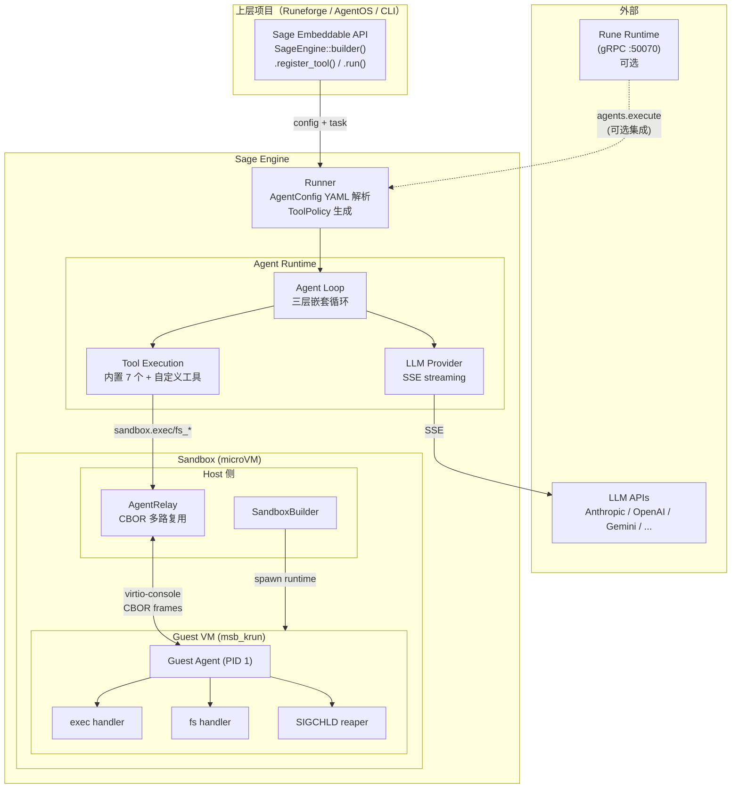
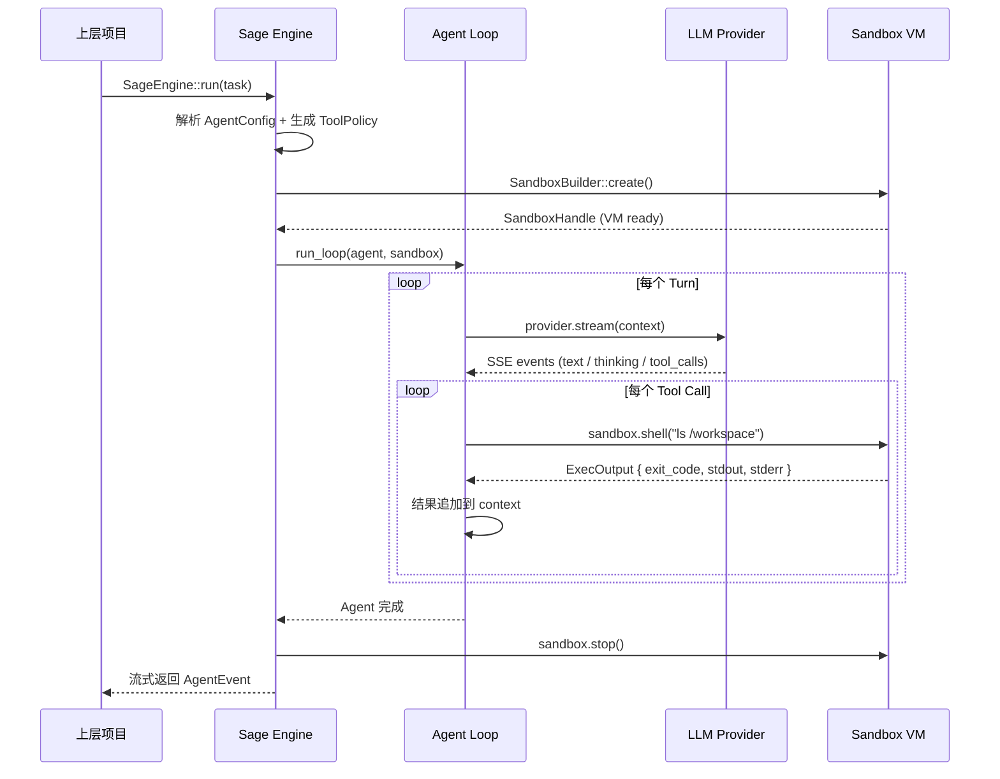
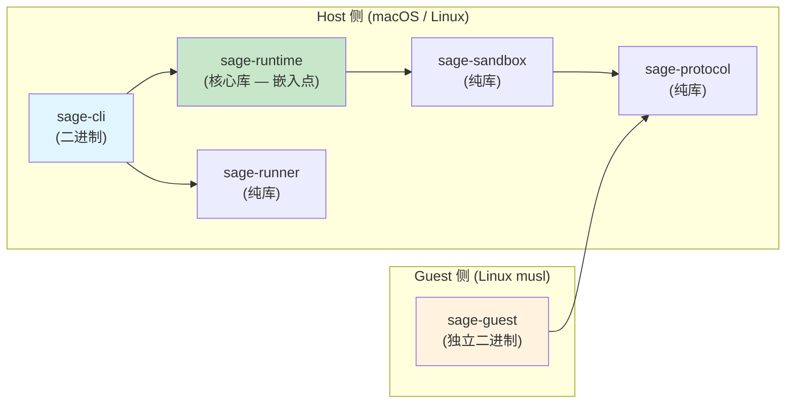
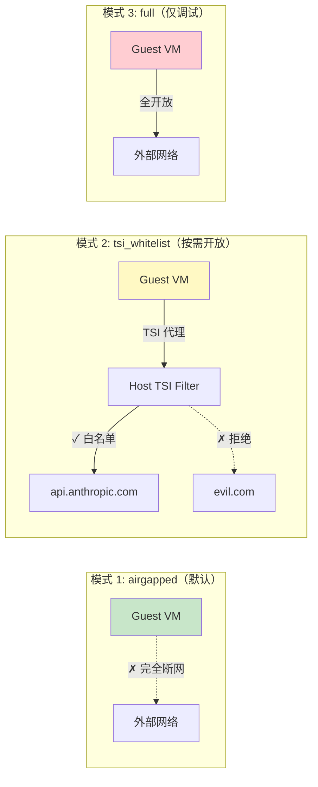
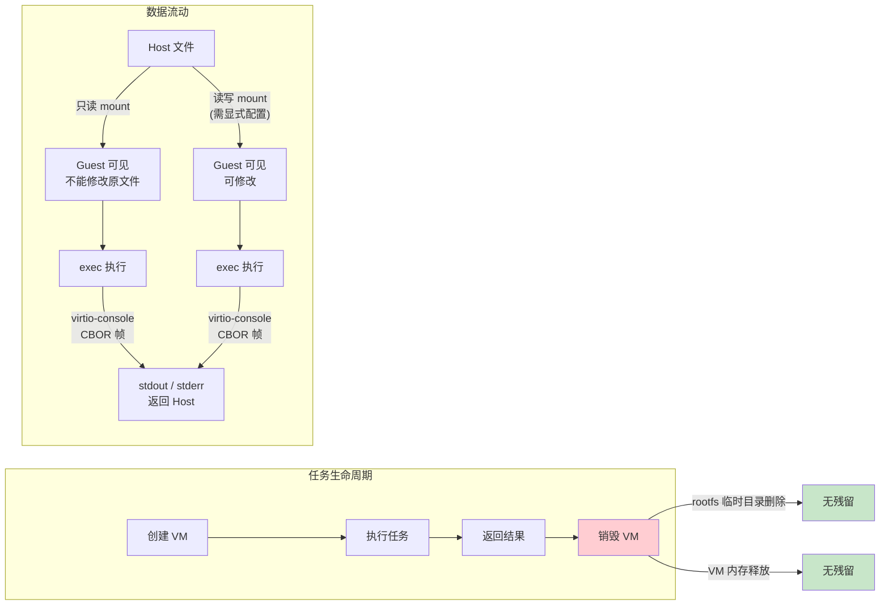

# Sage — 最终形态

## 一句话

**本地领域专家 Agent 平台 — 在你自己的机器上配置持续运行的专员，可扩展至生产多租户部署。**

在你的 Mac 或服务器上运行飞书专员、GitHub Review 专员、信息调研专员……每个 Agent 有独立的持久化 workspace 和不断积累的领域记忆。本地开箱即用，工具环境和 Claude Code 一样直接；需要多租户隔离时，一行配置升级到 microVM 沙箱。

Sage 同时也是一个可嵌入的执行引擎：Runeforge / AgentOS 等上层平台通过 `sage-runtime` Rust crate 嵌入 Sage，获得完整的 Agent 执行能力。

## 定位

```
                    ┌─────────────────────────────────────────┐
                    │          不是什么                         │
                    │                                         │
                    │  ✗ 必须在云上跑的 Agent 服务               │
                    │    （本地即可运行，云是可选的扩展）          │
                    │  ✗ 每次对话都从零开始的 AI 助手             │
                    │    （Memory 让它越用越懂你）               │
                    │  ✗ LLM 网关（不是 LiteLLM / OpenRouter）  │
                    └─────────────────────────────────────────┘

                    ┌─────────────────────────────────────────┐
                    │            是什么                         │
                    │                                         │
                    │  ✓ 本地领域专家 Agent 平台                 │
                    │    （飞书专员 / 代码专员 / 调研专员……）     │
                    │  ✓ Daemon 常驻：一直在线，等你找它          │
                    │  ✓ Memory 驱动：Agent 主动积累领域知识      │
                    │  ✓ Config-Driven：YAML 声明一切            │
                    │  ✓ 双模式：本地(none) / 生产(microVM)      │
                    └─────────────────────────────────────────┘
```

### 参考项目对标

| 项目 | 角色 | 早期用户 |
|------|------|--------|
| Claude Code | 本地编码专家 Agent | 开发者个人 |
| Hermes Agent | 本地多平台助手（多后端） | 个人 / 小团队 |
| **Sage** | 本地领域专家 Agent 平台（可扩展生产） | 个人 / 小团队 → 企业多租户 |

## 两种运行模式

Sage 从第一天就支持两种模式，面向不同场景：

| 模式 | 配置 | 适用 | 工具环境 |
|------|------|------|---------|
| **本地模式** | `sandbox: none` | 个人、小团队、可信环境 | 宿主机 PATH，brew / npm / pip 全部直接可用 |
| **生产模式** | `sandbox: microvm` | 多租户、企业、不可信任务 | Linux microVM + tools/ 持久化卷 |

早期用户绝大多数用**本地模式**：开箱即用，工具环境无需额外配置，和 Claude Code 体验一致。当需要在共享服务器上部署、或需要多 Agent 安全隔离时，切换到生产模式。

## 为什么 Daemon 比沙箱更重要（早期）

Claude Code / Codex 的核心问题：每次对话都从零开始，用户需要反复解释背景。

Sage 的核心价值在于 **Daemon 常驻 + Memory 积累**：

| | Claude Code / Codex | Sage |
|---|---|---|
| 运行模型 | 会话式（退出清空） | **Daemon 常驻**（一直在线） |
| 知识持久化 | CLAUDE.md（用户手动维护） | **MEMORY.md（Agent 主动更新）** |
| 领域 | 固定（编码） | **可配置（任意领域）** |
| 多 Agent | 不支持 | **支持（统一 TUI 管理）** |
| 沙箱 | 宿主机直接运行 | 本地 none / 生产 microVM |

**沙箱是生产升级路径，不是早期用户的门槛。** 对本地部署的早期用户而言，Daemon + Memory + Skills + Hook 才是核心价值。

## 核心公式

```
Sage = Agent Loop（三层嵌套循环 + Steering/FollowUp 队列）
     + LLM Provider（20+ Provider，SSE 流式）
     + Tools（7 个内置工具 + 自定义工具注册）
     + Sandbox（microVM 硬件级隔离）
     + Embeddable API（Config + Tool Registration + Hooks）
```

### 实现参考来源

Sage 的 Agent 核心算法和 LLM Provider 移植自 pi-mono（TypeScript），已验证的成熟实现：

| pi-mono 组件 | 行数 | 移植状态 | Sage 对应 |
|---|---|---|---|
| pi-agent-core（三层循环） | 1,887 | 移植中 | sage-runtime::agent_loop |
| pi-ai（20+ Provider） | 25,871 | 移植中 | sage-runtime::llm |
| pi-coding-agent（7 个工具） | ~3,000 | 移植中 | sage-runtime::tools |
| pi-coding-agent（TUI + 扩展） | ~37,000 | **不移植** | 上层项目自行实现 |
| pi-tui / pi-web-ui | ~25,000 | **不移植** | 上层项目自行实现 |

> 移植完成后，Sage 与 pi-mono 不再保持 fork 关系。Sage 是独立项目，后续独立演进。

## 架构

### 运行时拓扑



### 数据流



### Crate 结构

```
sage/                           # 项目根目录（原 agent-caster）
├── crates/
│   ├── sage-runtime/           # Agent 内核（原 agent-runtime）
│   │   └── src/
│   │       ├── engine.rs            # SageEngine — 嵌入式 API 入口
│   │       ├── agent.rs             # Agent 状态 + steer/followUp 队列
│   │       ├── agent_loop.rs        # 三层嵌套循环
│   │       ├── types.rs             # AgentMessage, AgentEvent, AgentTool
│   │       ├── event.rs             # EventStream（async channel）
│   │       ├── compaction.rs        # 上下文压缩
│   │       ├── llm/
│   │       │   ├── mod.rs           # LlmProvider trait + ApiRegistry
│   │       │   ├── types.rs         # Message, Model, Usage, Context
│   │       │   ├── stream.rs        # AssistantEvent 流式协议
│   │       │   ├── transform.rs     # 跨 Provider 消息转换
│   │       │   ├── models.rs        # 模型目录 + cost 计算
│   │       │   ├── keys.rs          # 多策略 API Key 解析
│   │       │   └── providers/
│   │       │       ├── anthropic.rs       # Anthropic Messages API
│   │       │       ├── openai.rs          # OpenAI Chat Completions
│   │       │       ├── openai_responses.rs # OpenAI Responses API
│   │       │       ├── google.rs          # Google Gemini
│   │       │       ├── bedrock.rs         # AWS Bedrock
│   │       │       ├── vertex.rs          # Google Vertex AI
│   │       │       ├── azure.rs           # Azure OpenAI
│   │       │       ├── groq.rs            # Groq
│   │       │       ├── mistral.rs         # Mistral
│   │       │       ├── xai.rs             # xAI (Grok)
│   │       │       ├── deepseek.rs        # DeepSeek
│   │       │       ├── ollama.rs          # Ollama (本地)
│   │       │       ├── github_copilot.rs  # GitHub Copilot
│   │       │       ├── together.rs        # Together AI
│   │       │       ├── fireworks.rs       # Fireworks AI
│   │       │       ├── sambanova.rs       # SambaNova
│   │       │       ├── cerebras.rs        # Cerebras
│   │       │       ├── openai_compat.rs   # 通用 OpenAI 兼容（LM Studio / vLLM）
│   │       │       └── mod.rs             # Provider 注册 + lazy init
│   │       └── tools/
│   │           ├── mod.rs           # SageTool trait + 并行/顺序执行
│   │           ├── bash.rs          # → sandbox.shell()
│   │           ├── read.rs          # → sandbox.fs_read()
│   │           ├── write.rs         # → sandbox.fs_write()
│   │           ├── edit.rs          # 精确替换 + fuzzy match + diff
│   │           ├── grep.rs          # ripgrep 封装
│   │           ├── find.rs          # glob/fd 封装
│   │           ├── ls.rs            # 目录列表
│   │           └── truncate.rs      # 输出截断（2000行/50KB）
│   │
│   ├── sage-cli/                # CLI 验证界面（原 caster）
│   │   └── src/
│   │       ├── main.rs              # sage run / serve / test
│   │       └── serve.rs             # Rune 集成（可选）
│   │
│   ├── sage-sandbox/            # 沙箱引擎（原 sandbox）
│   │   └── src/
│   │       ├── builder.rs           # SandboxBuilder（rootfs + spawn）
│   │       ├── handle.rs            # SandboxHandle（exec/fs/stop）
│   │       ├── relay.rs             # AgentRelay（CBOR 多路复用）
│   │       ├── error.rs
│   │       └── bin/
│   │           └── sandbox_runtime.rs  # VMM 宿主进程
│   │
│   ├── sage-protocol/           # Host↔Guest 线协议（原 protocol）
│   │   └── src/
│   │       ├── messages.rs          # HostMessage / GuestMessage
│   │       └── wire.rs              # 长度前缀 CBOR
│   │
│   ├── sage-guest/              # VM 内执行器（原 guest-agent）
│   │   └── src/
│   │       ├── main.rs              # PID 1 主循环
│   │       ├── init.rs              # mount /proc /sys /dev
│   │       ├── exec.rs              # 命令执行
│   │       └── fs.rs                # 文件操作
│   │
│   └── sage-runner/             # 任务配置（原 runner）
│       └── src/
│           ├── config.rs            # AgentConfig（YAML）
│           └── tools.rs             # ToolPolicy（白名单）
```

### 依赖图



> `sage-runtime` 是嵌入点（绿色）。上层项目依赖 `sage-runtime`，不需要依赖 `sage-cli`。

## 嵌入式 API（核心接口）

Sage 作为 primitive 的核心价值：上层项目通过 Rust API 嵌入 Sage 引擎。

### 基本用法

```rust
use sage_runtime::engine::SageEngine;
use sage_runtime::event::AgentEvent;
use sage_runtime::types::*;

// 通过 builder API 创建引擎
let engine = SageEngine::builder()
    .system_prompt("你是一个代码助手。")
    .provider("anthropic")
    .model("claude-haiku-4-5-20251001")
    .max_tokens(8192)
    .max_turns(30)
    .builtin_tools(&["bash", "read", "write", "edit", "grep", "ls"])
    .build()?;

// 运行任务，获取事件流
let mut stream = engine.run("在 /workspace 下创建一个 Rust hello world 项目").await?;

// 消费事件流
while let Some(event) = stream.next().await {
    match event {
        AgentEvent::AgentEnd { messages } => {
            for msg in &messages {
                if let AgentMessage::Assistant(a) = msg {
                    for c in &a.content {
                        if let Content::Text { text } = c {
                            println!("{text}");
                        }
                    }
                }
            }
        }
        AgentEvent::ToolExecutionStart { tool_name, .. } => {
            eprintln!("[tool: {tool_name}]");
        }
        _ => {}
    }
}
```

### 自定义工具注册

```rust
use sage_runtime::engine::SageEngine;
use sage_runtime::tools::AgentTool;

// 实现 AgentTool trait
struct FeishuTool { /* ... */ }

#[async_trait::async_trait]
impl AgentTool for FeishuTool {
    fn name(&self) -> &str { "feishu" }
    fn description(&self) -> &str { "查询和操作飞书日程、文档、消息" }
    fn input_schema(&self) -> serde_json::Value { /* JSON Schema */ }

    async fn execute(&self, args: &serde_json::Value) -> sage_runtime::tools::ToolResult {
        // 自定义执行逻辑（不经过沙箱，由上层项目负责安全）
        todo!()
    }
}

// 通过 builder 注册到引擎
let engine = SageEngine::builder()
    .system_prompt("你是飞书助手。")
    .provider("anthropic")
    .model("claude-haiku-4-5-20251001")
    .register_tool(FeishuTool::new())
    .build()?;
```

### 生命周期 Hooks

```rust
use sage_runtime::engine::SageEngine;
use sage_runtime::agent::{BeforeToolCallHook, AfterToolCallHook, HookResult};

struct AuditHook;

impl BeforeToolCallHook for AuditHook {
    fn before_tool_call(&self, tool_name: &str, input: &serde_json::Value) -> HookResult {
        // 安全审批 / 日志 / 用量统计
        tracing::info!(tool = tool_name, "工具即将执行");
        HookResult::Continue
    }
}

impl AfterToolCallHook for AuditHook {
    fn after_tool_call(&self, tool_name: &str, result: &str) -> HookResult {
        // 结果审计 / 敏感信息过滤
        tracing::info!(tool = tool_name, "工具执行完成");
        HookResult::Continue
    }
}

let engine = SageEngine::builder()
    .system_prompt("...")
    .provider("anthropic")
    .model("claude-haiku-4-5-20251001")
    .on_before_tool_call(AuditHook)
    .on_after_tool_call(AuditHook)
    .build()?;
```

### 对比：openclaw 用 pi-mono 的方式

```typescript
// openclaw 嵌入 pi-mono（TypeScript）
import { createAgentSession } from '@mariozechner/pi-coding-agent'

const session = createAgentSession({
    model: "claude-sonnet-4-20250514",
    customTools: [myTool],
    resourceLoader: myLoader,
})
session.subscribe(event => { /* ... */ })
session.prompt("帮我查飞书日程")
```

```rust
// Runeforge 嵌入 Sage（Rust）— 等价的 API 面
let engine = SageEngine::builder()
    .system_prompt("你是飞书助手。")
    .provider("anthropic")
    .model("claude-haiku-4-5-20251001")
    .register_tool(my_tool)
    .build()?;

let mut stream = engine.run("帮我查飞书日程").await?;
// stream: EventReceiver<AgentEvent, Vec<AgentMessage>>
```

## 扩展模型

三层扩展，覆盖不同需求粒度：

```
Layer 1: AgentConfig YAML（声明式，零代码）── 80% 场景
  ├─ LLM provider / model 选择
  ├─ 内置工具开关 + 白名单
  ├─ 沙箱资源限制（CPU / 内存 / 网络）
  ├─ 约束（max_turns / timeout）
  └─ Toolset 预设（coding / ops / web）

Layer 2: Tool Registration API（编程式，Rust trait）── 15% 场景
  ├─ 实现 SageTool trait 注入自定义工具
  ├─ 工具在沙箱外执行（上层项目负责安全）
  ├─ 可覆盖内置工具行为
  └─ 运行时动态注册 / 注销

Layer 3: Lifecycle Hooks（编程式，回调）── 5% 场景
  ├─ PreToolUse / PostToolUse（安全审批、日志）
  ├─ AgentStart / AgentEnd（资源管理）
  ├─ OnError（错误处理策略）
  └─ OnContextOverflow（自定义压缩策略）
```

### 不做的扩展

| 不做 | 理由 | 谁来做 |
|------|------|--------|
| MCP 协议 | 产品层协议，不是引擎层该管的 | 上层项目实现 MCP → SageTool 适配 |
| 插件清单发现 | 引擎不管发现，只管注册 | 上层项目扫描 + 注册 |
| 动态代码加载 | 安全风险，不在引擎层开口 | 上层项目自行管理 |
| 消息平台适配 | 平台层职责 | Runeforge / AgentOS |
| 学习 / 记忆 | 产品层功能 | 上层项目通过 Hooks 实现 |

## 使用方式

### 方式 1：独立运行（验证 + 开发）

```bash
# 最简路径：YAML 配置 + 一条命令
sage run --config coding-assistant.yaml \
    --message "在 /workspace 下创建一个 Rust hello world 项目并运行它"

# Agent 循环在本地 microVM 中执行
# 流式输出 AgentEvent 到终端
# 用于：引擎验证、本地开发、CI/CD 集成
```

### 方式 2：Rune 集成（分布式调度）

```bash
# 注册为 Rune Caster，接受远程任务派发
sage serve --rune localhost:50070

# 注册 agents.execute rune
# 通过 Rune Runtime 接收任务
# 流式事件通过 Rune StreamSender 推送
# 用于：Runeforge、AgentOS 等分布式场景
```

```
任何 Rune 应用（Runeforge / AgentOS / 其他 Caster）
       │
       │  POST /runes/agents.execute
       │  {
       │    "config": { ... AgentConfig ... },
       │    "task": "帮我查一下飞书日程"
       │  }
       ▼
  Sage（注册为 Rune Caster）
       │
       │  1. 解析 AgentConfig
       │  2. 创建 Sandbox（microVM）
       │  3. 启动 Agent Loop
       │  4. 流式返回事件 → Rune StreamSender
       │  5. Agent 完成 → 销毁 Sandbox
       ▼
  Rune 应用收到结果
```

### 方式 3：库嵌入（上层项目集成）

```rust
// 上层项目在 Cargo.toml 中依赖 sage-runtime
// 不需要 sage-cli，不需要独立进程
[dependencies]
sage-runtime = "0.1"
```

详见「嵌入式 API」章节。

### AgentConfig 示例

```yaml
name: coding-assistant
description: "代码助手 — 在沙箱中安全执行代码任务"

llm:
  provider: anthropic
  model: claude-sonnet-4-20250514
  max_tokens: 8192

system_prompt: |
  你是一个代码助手。你可以执行 shell 命令、读写文件来完成任务。
  所有操作在隔离沙箱中执行，不会影响宿主系统。

tools:
  bash:
    allowed_binaries: [python3, node, cargo, git, rg, fd]
  read:
    allowed_paths: ["/workspace"]
  write:
    allowed_paths: ["/workspace"]
  edit:
    allowed_paths: ["/workspace"]
  grep: {}
  find: {}
  ls: {}

constraints:
  max_turns: 30
  timeout_secs: 300

sandbox:
  cpus: 2
  memory_mib: 1024
  # [PLANNED] volumes — 未实现，SandboxConfig 尚无 volumes 字段
  # volumes:
  #   - host: "./project"
  #     guest: "/workspace"
  #     read_only: false
  network: airgapped  # whitelist/full 尚未实现
```

## Agent 核心算法

从 pi-agent-core 移植的三层嵌套循环：

```
OUTER LOOP（Follow-Up 队列）
│
├─ while (true) {
│
│   INNER LOOP（Steering 队列 + Tool Calls）
│   ├─ while (hasToolCalls || hasSteering) {
│   │
│   │   注入 steering 消息（如有）
│   │
│   │   INNERMOST（LLM 流式调用）
│   │   ├─ transformContext → 压缩/裁剪上下文
│   │   ├─ convertToLlm → 转为 Provider 格式
│   │   ├─ provider.stream() → SSE 事件流
│   │   ├─ 逐事件发射 AgentEvent（text_delta / thinking / toolcall）
│   │   └─ 返回完整 AssistantMessage
│   │
│   │   提取 tool calls
│   │
│   │   执行工具（并行或顺序）：
│   │   ├─ prepare（查找工具 + 校验参数 + PreToolUse hook）
│   │   ├─ execute（内置工具通过 sandbox，自定义工具直接调用）
│   │   ├─ finalize（PostToolUse hook + 发射事件）
│   │   └─ 结果作为 ToolResultMessage 追加到上下文
│   │
│   │   检查 steering 队列
│   │ }
│
│   检查 follow-up 队列
│   有新消息 → continue | 没有 → break
│ }
```

### 事件流协议

上层项目通过事件订阅跟踪 Agent 执行进度：

```
agent_start
  └─ turn_start
       ├─ message_start (assistant)
       │    └─ message_update (text_delta / thinking_delta / toolcall_delta) × N
       ├─ message_end (assistant)
       │
       ├─ tool_execution_start (tool A)
       ├─ tool_execution_end (tool A)
       ├─ message_start (tool result A)
       ├─ message_end (tool result A)
       │
       ├─ tool_execution_start (tool B)  ← 并行执行时多个同时进行
       ├─ tool_execution_end (tool B)
       ├─ message_start (tool result B)
       ├─ message_end (tool result B)
       │
       └─ turn_end
  └─ turn_start (下一轮，如果还有 tool calls)
       └─ ...
agent_end
```

## 上下文工程策略

> 对比 Pi (Warp) 和 Claude Code 的上下文工程后，确定 Sage 作为引擎层的策略。
> 完整分析报告：`~/Dev/cc/context-engineering-report/index.html`

### 设计原则

Sage 是 primitive，不是 product。上下文工程只做引擎层该做的事：

| 做 | 不做（上层项目职责） |
|---|---|
| 双层压缩（microcompact + LLM 摘要） | 结构化记忆系统 |
| Provider 级 prompt caching | CLAUDE.md / AGENTS.md 指令层级 |
| 结构化 system prompt builder | Skills / Prompt Templates |
| Context budget 预算管理 | System Reminder 中间注入 |
| transformContext hook（注入点） | 记忆生命周期管理 |

### 双层压缩

当前 Sage 已有 LLM 摘要式 compaction。增加 microcompact 轻量层后形成两级策略：

```
Context 使用率:
  0%────────75%──────────90%──────────100%
  │  正常    │ microcompact │ full compact │ overflow
  │          │ (清除旧 tool  │ (LLM 摘要)   │
  │          │  result 内容) │              │
```

Microcompact 零 LLM 开销，只做结构保留的内容清理：
- 清除超过 N 轮的 `ToolResultMessage` 内容（保留 tool_call_id / tool_name / is_error）
- 清除旧的 Thinking blocks（只保留最近 2-3 turn）
- 上层项目可通过 `on_context_overflow` hook 自定义策略

参考来源：CC `apiMicrocompact.ts` 的 `context_edit` 策略（Sage 在客户端实现，不依赖 API 原生能力）。

### Prompt Caching

引擎层只做最简单的 provider 级缓存标记，不做 CC 那套 memoized section / sticky-on latch / cache break detection（产品级复杂度，引擎不需要）：

```
Anthropic Provider:
  system prompt block → cache_control: { type: "ephemeral" }  // 5 分钟 TTL
  最后一条 user msg   → cache_control: { type: "ephemeral" }

其他 Provider:
  无 caching 标记（各家 API 不统一，上层项目按需处理）
```

两个 cache breakpoint 在连续对话中能显著降低 Anthropic API 成本。

### SystemPromptBuilder

将 system prompt 从裸 `String` 升级为结构化 builder，让上层项目可以分区组装并标记缓存友好性：

```rust
let prompt = SystemPromptBuilder::new()
    .cacheable_section("base", "你是一个代码助手...")       // 稳定内容
    .cacheable_section("tools_guide", "使用工具时...")       // 稳定内容
    .section("project_context", &load_project_rules())      // 动态内容
    .section("metadata", &format!("日期: {}", today))       // 每次变化
    .build();
```

Provider 层根据 `cacheable` 标记自动加 `cache_control`（目前只有 Anthropic 支持）。

参考来源：Pi `system-prompt.ts` 的 `buildSystemPrompt()` 分区拼装 + CC `systemPromptSections.ts` 的 memoized/volatile 分类。

### transformContext Hook

给上层项目提供 LLM 调用前修改消息列表的正式接口：

```rust
let engine = SageEngine::builder()
    .system_prompt("...")
    .on_transform_context(|messages| {
        // 注入项目记忆、过滤敏感信息、自定义压缩...
        messages.insert(0, memory_message);
    })
    .build()?;
```

这是 Sage "不做记忆/不做指令层级" 的配套设计——引擎提供注入点，产品层通过 hook 实现。

参考来源：Pi `agent/src/types.ts` 的 `transformContext` option。

## 安全模型

### 威胁模型

Sage 面对的核心威胁：**LLM 生成的代码不可信。**

Agent 的 tool calls 由 LLM 决定，LLM 可能被 prompt injection 操纵、产生幻觉、或生成恶意代码。这些代码在服务器上执行，不是在用户自己的笔记本上。

```
威胁源                    攻击面                     后果
─────────                ──────                    ────
Prompt injection    →    bash tool 执行恶意命令   →  数据泄露 / 系统破坏
LLM 幻觉            →    rm -rf / 写入敏感路径    →  文件丢失
恶意任务提交         →    耗尽 CPU / 内存 / 磁盘   →  DoS
越权访问            →    读取其他 Agent 的数据     →  多租户隔离失败
网络外联            →    curl 外发敏感数据         →  数据外泄
```

### 纵深防御架构

四层防御，每层独立生效，任一层被突破不影响其他层：

```
┌──────────────────────────────────────────────────────────────┐
│  Layer 0: Hardware Virtualization (KVM / HVF)                │
│  隔离什么：内存、CPU、中断                                      │
│  怎么隔离：硬件虚拟化扩展，每个 VM 独立地址空间                    │
│  突破条件：VM escape 漏洞（极罕见）                              │
│                                                              │
│  ┌────────────────────────────────────────────────────────┐  │
│  │  Layer 1: microVM (msb_krun)                           │  │
│  │  隔离什么：文件系统、进程树、网络栈                         │  │
│  │  怎么隔离：                                              │  │
│  │  - 最小 rootfs（~2MB: sage-guest + busybox）            │  │
│  │  - 无 ssh / 无 package manager / 无多余工具               │  │
│  │  - 独立 Linux 内核（libkrunfw 提供）                      │  │
│  │  - Volume mount 只挂载显式允许的路径                       │  │
│  │  突破条件：Guest 内核提权 + VM escape                      │  │
│  │                                                         │  │
│  │  ┌──────────────────────────────────────────────────┐   │  │
│  │  │  Layer 2: Guest Agent 策略执行                     │   │  │
│  │  │  隔离什么：可执行的命令、可访问的文件路径              │   │  │
│  │  │  怎么隔离：                                        │   │  │
│  │  │  - 二进制白名单（ToolPolicy.allowed_binaries）     │   │  │
│  │  │  - 文件路径约束（ToolPolicy.allowed_read/write）   │   │  │
│  │  │  - exec 前拦截，不在白名单直接拒绝                   │   │  │
│  │  │  - 校验在 Host 侧完成（Guest Agent 透传执行）       │   │  │
│  │  │  突破条件：白名单配置错误                            │   │  │
│  │  │                                                    │   │  │
│  │  │  ┌────────────────────────────────────────────┐    │   │  │
│  │  │  │  Layer 3: Landlock LSM + seccomp-bpf       │    │   │  │
│  │  │  │  隔离什么：系统调用、内核接口                  │    │   │  │
│  │  │  │  怎么隔离：                                  │    │   │  │
│  │  │  │  - seccomp: 只允许必要系统调用               │    │   │  │
│  │  │  │    (read/write/open/close/exec/exit/...)    │    │   │  │
│  │  │  │  - Landlock: 限制文件系统访问范围             │    │   │  │
│  │  │  │    即使 Guest Agent 被绕过，内核层仍拦截      │    │   │  │
│  │  │  │  突破条件：内核漏洞                           │    │   │  │
│  │  │  └────────────────────────────────────────────┘    │   │  │
│  │  └──────────────────────────────────────────────────┘   │  │
│  └────────────────────────────────────────────────────────┘  │
└──────────────────────────────────────────────────────────────┘
```

### 资源限制

防止 DoS 和资源耗尽：

| 资源 | 限制手段 | 默认值 |
|---|---|---|
| CPU | VM vCPU 数量 | 1-2 cores |
| 内存 | VM memory_mib | 256-1024 MB |
| 时间 | exec timeout + VM idle timeout | 120s / 300s |
| 磁盘 | rootfs 大小 + tmpfs 限制 | 最小 rootfs，/tmp 限额 |
| 并发 | Engine Semaphore | max_concurrent (默认 3) |
| 超时 | VM 强制 kill | timeout 后 SIGKILL runtime 进程 |

### 网络安全

三种网络模式：



> TSI = msb_krun 的 Transparent Socket Impersonation，在 Host 侧代理 Guest 网络请求，按域名过滤。

### 数据安全



### 安全边界总结

| 攻击 | Layer 0 (HVF/KVM) | Layer 1 (microVM) | Layer 2 (Policy) | Layer 3 (LSM) |
|---|---|---|---|---|
| `rm -rf /` | — | Guest rootfs 被删，Host 无影响 | 白名单拦截 rm | Landlock 拦截 |
| 读 /etc/passwd (Host) | VM 内无 Host 文件 | 未 mount 则不可见 | 路径校验 | — |
| `curl evil.com` | — | airgapped 断网 | 白名单无 curl | — |
| fork bomb | vCPU 上限 | VM 内存上限 | — | seccomp 可限 fork 数 |
| 写入 10GB 文件 | — | tmpfs 限额 | 路径约束 | — |
| 跨 Agent 读数据 | 独立 VM 地址空间 | 独立 rootfs | — | — |
| 逃逸到 Host | 硬件虚拟化隔离 | — | — | — |

## 功能全景

### 已完成（v0.0.1）

| 功能 | 状态 | 说明 |
|---|---|---|
| CBOR 线协议 | done | 22 个测试，全类型覆盖 |
| Guest Agent 主循环 | done | exec/fs handler + SIGCHLD reaper |
| AgentRelay 通信 | done | CBOR 多路复用 + request_id 路由 |
| SandboxBuilder | done | rootfs 准备 + spawn runtime |
| SandboxHandle | done | exec/shell/fs_read/fs_write/fs_list/stop |
| sandbox-runtime 二进制 | done | msb_krun VmBuilder 集成 |
| AgentConfig YAML 解析 | done | 19 个测试 |
| ToolPolicy 白名单 | done | 二进制 + 路径校验 |
| --local-test 模式 | done | 本地端到端测试 |

### 目标功能（最终形态）

| 功能 | 层级 | 来源 |
|---|---|---|
| **Agent 核心** | | |
| 三层嵌套循环 | sage-runtime | pi-agent-core |
| Steering / Follow-Up 队列 | sage-runtime | pi-agent-core |
| PreToolUse / PostToolUse hook | sage-runtime | 自研（参考 Claude Code） |
| 并行 / 顺序工具执行 | sage-runtime | pi-agent-core |
| 事件流（AgentEvent） | sage-runtime | pi-agent-core |
| 上下文压缩（token 超限时 LLM 摘要） | sage-runtime | pi-coding-agent |
| Microcompact（轻量 tool result 清理） | sage-runtime | 自研（参考 Claude Code） |
| Prompt Caching（Anthropic cache_control） | sage-runtime::llm | 自研（参考 Claude Code） |
| SystemPromptBuilder（结构化 prompt 分区） | sage-runtime | 自研（参考 Pi + Claude Code） |
| Context Budget（主动预算管理） | sage-runtime | 自研（参考 Claude Code） |
| transformContext Hook（上下文注入点） | sage-runtime | 自研（参考 Pi） |
| **嵌入式 API** | | |
| SageEngine 入口 | sage-runtime | 自研 |
| SageTool trait（自定义工具注册） | sage-runtime | 自研（参考 pi-mono customTools） |
| Lifecycle Hooks（4 个事件点） | sage-runtime | 自研（参考 Claude Code hooks） |
| Toolset 预设组合 | sage-runner | 自研（参考 Hermes toolsets） |
| **LLM 接入（20+ Provider 全量）** | | |
| Anthropic Messages API（SSE） | sage-runtime::llm | pi-ai |
| OpenAI Chat Completions + Responses | sage-runtime::llm | pi-ai |
| Google Gemini | sage-runtime::llm | pi-ai |
| AWS Bedrock | sage-runtime::llm | pi-ai |
| Google Vertex AI | sage-runtime::llm | pi-ai |
| Azure OpenAI | sage-runtime::llm | pi-ai |
| Groq / Mistral / xAI / DeepSeek | sage-runtime::llm | pi-ai |
| Ollama / LM Studio / vLLM（本地） | sage-runtime::llm | pi-ai |
| GitHub Copilot / Together / Fireworks | sage-runtime::llm | pi-ai |
| SambaNova / Cerebras | sage-runtime::llm | pi-ai |
| 通用 OpenAI 兼容 | sage-runtime::llm | pi-ai |
| 跨 Provider 消息转换 | sage-runtime::llm | pi-ai |
| Thinking/Reasoning 模式 | sage-runtime::llm | pi-ai |
| Token 计数 + 费用追踪 | sage-runtime::llm | pi-ai |
| 模型目录 + 自动发现 | sage-runtime::llm | pi-ai |
| **内置工具** | | |
| bash（shell 命令执行） | sage-runtime::tools | pi-coding-agent |
| read（文件读取 + 图片检测） | sage-runtime::tools | pi-coding-agent |
| write（文件创建/覆盖） | sage-runtime::tools | pi-coding-agent |
| edit（精确替换 + fuzzy match + diff） | sage-runtime::tools | pi-coding-agent |
| grep（ripgrep 封装） | sage-runtime::tools | pi-coding-agent |
| find（glob/fd 封装） | sage-runtime::tools | pi-coding-agent |
| ls（目录列表） | sage-runtime::tools | pi-coding-agent |
| 输出截断（head/tail, 2000行/50KB） | sage-runtime::tools | pi-coding-agent |
| **沙箱** | | |
| microVM 隔离（msb_krun + HVF/KVM） | sage-sandbox | 自研 |
| CBOR over virtio-console 通信 | sage-protocol | 自研 |
| 最小 rootfs（sage-guest + busybox） | sage-sandbox | 自研 |
| Volume mount（只读/读写） | sage-sandbox | 自研 |
| Landlock LSM + seccomp-bpf | sage-sandbox | 自研 |
| 网络策略（airgapped / TSI 白名单） | sage-sandbox | 自研 |
| OCI 镜像支持（自定义 rootfs） | sage-sandbox | 自研 |
| VM 快照 / 快速恢复 | sage-sandbox | 自研 |
| VM 预热池 | sage-sandbox | 自研 |
| **集成** | | |
| sage run（CLI 验证界面） | sage-cli | 自研 |
| sage serve --rune（Rune Caster 注册） | sage-cli | 自研 |
| sage test（CI/CD 模式） | sage-cli | 自研 |
| 流式事件推送（StreamSender） | sage-cli | 自研 |
| 并发控制（Semaphore） | sage-runtime | 自研 |
| 健康上报（pressure 指标） | sage-cli | 自研 |
| **运维** | | |
| OpenTelemetry 链路追踪 | sage-cli | 自研 |
| 结构化日志 | 全局 | 自研 |
| macOS HVF entitlements 签名 | 构建 | 自研 |
| 交叉编译流水线（aarch64 musl） | 构建 | 自研 |

## 关键设计决策

| 决策 | 选择 | 理由 |
|---|---|---|
| 定位 | Primitive（可嵌入引擎） | 类比 SQLite — 被上层项目集成，不是最终产品 |
| 语言 | Rust | 性能、安全、与 msb_krun 同生态 |
| VM 库 | msb_krun | 纯 Rust，Apple Silicon HVF 原生支持 |
| Host↔Guest 通信 | virtio-console + CBOR | 简单字节流，零配置，CBOR 高效紧凑 |
| Agent 算法来源 | pi-agent-core | 已验证的三层循环，事件驱动 |
| LLM 内嵌 vs 独立服务 | 内嵌（sage-runtime::llm） | 引擎内聚，嵌入方不需要额外部署 LLM 代理 |
| 工具执行位置 | 内置工具在 VM 内，自定义工具在 Host | 安全边界清晰，自定义工具由上层负责 |
| CLI / TUI | 最小 CLI（sage run） | 验证引擎可靠性，不是面向用户的产品 |
| 扩展模型 | Config + Tool trait + Hooks（3 层） | 覆盖 80/15/5 场景分布，不过度抽象 |
| 工具执行策略 | 支持并行 + 顺序 | 保留 pi-mono 的灵活性 |
| Rune 集成 | 可选（sage serve --rune） | 独立可用，Rune 是增强不是依赖 |

## 代码量预估

| Crate | 来源 | 预估 Rust 行数 |
|---|---|---|
| sage-runtime（核心 + 工具 + 嵌入 API） | pi-agent-core + pi-coding-agent + 自研 | ~5,000 |
| sage-runtime::llm（全量 Provider） | pi-ai 全量 25,871 行 | ~12,000 |
| sage-cli | 自研 | ~800 |
| sage-sandbox | 已完成 + 扩展 | ~800 |
| sage-protocol | 已完成 | ~300 |
| sage-guest | 已完成 | ~230 |
| sage-runner | 已完成 + toolset | ~500 |
| **合计** | | **~19,600** |

---

## 领域专家 Agent 扩展架构

在可嵌入引擎之上，Sage 独立 Agent 产品层围绕五层知识体系构建领域专家能力：

| 层 | 机制 | 由谁维护 | 存储位置 |
|---|---|---|---|
| **Hook** | 确定性质量门控（代码层 Harness） | 开发者 | agent.yaml / hooks.yaml |
| **Skill** | 全局只读 Markdown SOP | 开发者/领域专家 | ~/.sage/skills/ |
| **Craft** | Agent 自管理可复用产物（任意类型） | Agent 自管理 | workspace/craft/ |
| **Wiki** | LLM 维护的结构化领域知识库 | Agent（IDLE 时自动） | workspace/wiki/ |
| **Memory** | 操作性短期记忆 | Agent + 用户 | workspace/memory/ |

常驻 Daemon 模式让 Agent 在任务间隙自动维护 Wiki、评估 Craft 效率、积累 TaskRecord 评测数据。

---

## 文档导航

| 文档 | 内容 |
|------|------|
| [design/knowledge-system.md](design/knowledge-system.md) | 四层知识架构 + Wiki 维护机制（What & Why） |
| [design/daemon.md](design/daemon.md) | Daemon 运行模型 + VM Pool + Channel + 触发系统 |
| [design/hook-craft.md](design/hook-craft.md) | Hook 机制 + Skill/Craft 两级架构 |
| [design/eval.md](design/eval.md) | TaskRecord 评测系统 + MetricsCollector |
| [design/harness.md](design/harness.md) | Harness 工程设计：Eval 脚本契约 + sage test + CI 集成 |
| [roadmap.md](roadmap.md) | v0.7–v0.9 产品路线图（When & How） |
